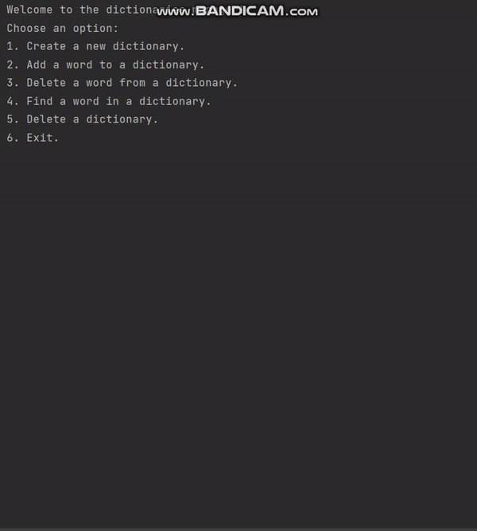

# Dynamic-Dictionaries
Dynamic allocated dictionaries in C language

<h4> this my first project from my B.A in the 'introduction to Computer Science' course, that using malloc allocation,
In this project I used valgrind to detect any memory leaks.</h4>

This is just a normal dictionaries that can support alot of languages simultaneously,
  just follow along the program and you will get the hang of it.

